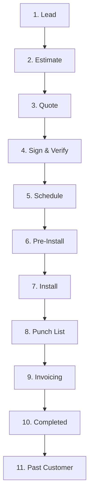

# RHIVE OS: MASTER EXECUTION & TACTICAL ROADMAP

This document outlines the 9 strategic initiatives for today, prioritized by business impact, operational dependencies, and execution speed. It serves as our master plan. Once reviewed and modified, it will guide our Node Specialists (N1-N4) and automated subagents.

---

## 📊 EXECUTIVE PRIORITIZATION MATRIX

| Priority | Task ID | Initiative | Primary Owner | Business Impact | Technical Dependency |
| :--- | :--- | :--- | :--- | :--- | :--- |
| **1 (Highest)** | **Task 2A** | CRM Frontend & Step-by-Step Info Mapping | Node 1 (FE) / Node 2 (BE) | **CRITICAL:** Replaces Excel sheets, prevents human errors, and drives 11-stage sales pipeline. | High (Requires layout design) |
| **2** | **Task 4** | Same Page Meeting & Team Status Ingestion | Node 2 (BE) / Coordinator | **MED:** Syncs AI context with human operations (Maureen, Van, Sheena, Victor). | Med (Audio transcription) |
| **3** | **Task 9** | Google Calendar Optimization & Training | Admin | **MED:** Reclaims 30+ hours of executive focus for Michael and Kara. | Low (Config setup) |
| **4** | **Task 2** | Repo Audit: Old vs. Current RHIVE OS | Node 3 (DevOps) | **MED:** Prevents lost features and aesthetic divergence from the original OS. | **COMPLETE** |
| **5** | **Task 3** | Omni-Clone App Integration for Antigravity | Node 1 (FE) / Node 2 (BE) | **LOW:** Unifies user interface inside the Antigravity developer workflow. | Med (State sync) |
| **6** | **Task 7** | YouTube Transcription & Audio Briefs | Integration / AI Agent | **LOW:** Speeds up tech intake and innovation ideas in audio format. | Med (YT API & TTS) |
| **7** | **Task 6** | Tech Billionaire Social Media PR Plan | PR Agent / Content | **LOW:** Build long-term authority and personal branding. | Low (Asset folders only) |
| **8** | **Task 5** | $3M/Yr Bid & Quote Email Automation Skill | Node 2 (BE) / Integration | **HIGH:** Directly sources warm and cold leads from email and job sites automatically. | High (Requires Beta Spec) |
| **9 (Lowest)** | **Task 1** | Beta Template Inputs & Input Agent Spec | Node 2 (BE) / AI Agent | **HIGH:** Enables AI bidding automation; requires manual RPA variable mapping first. | High (Requires manual review) |

---

## 🔄 EXECUTIVE ROI TRANSLATIONS
Consistent with our **Autopsy Patch Protocol**, here is the business impact translation of these technical tasks:

*   **Jargon:** *Refactoring the `projects` collection schema to enforce 11-stage validation gates.*
    *   **Impact:** Prevents sales reps from sending certified quotes without automated roof calculations, protecting project margins.
*   **Jargon:** *Binding Google Solar API `buildingInsights` data into the `PricingCalculator` class.*
    *   **Impact:** Automatically extracts roof pitch, area, and waste factors to give the customer an instant price while hiding internal costs.
*   **Jargon:** *Deploying a headless Puppeteer node to parse email bids and cross-reference with Roofr.*
    *   **Impact:** Automatically pulls high-ticket commercial bid opportunities into the CRM for human review before competitors even open the email.
*   **Jargon:** *Restructuring calendar layers using the Dan Martell Color-Block API.*
    *   **Impact:** Visually locks Michael and Kara's calendar into high-revenue activities, forcing delegation of scheduling conflicts to admins.

---

## 🎯 DETAIL TASK-BY-TASK EXECUTION PLAN

---

### 1️⃣ PRIORITY 1: CRM Frontend & Stage Mapping (Task 2A)
*   **Strategic Goal:** Map out the exact required information, views, and functions at every stage of the 11-stage CRM pipeline. Replaces the spreadsheet-based tracking with a high-density, gamified dashboard.
*   **Aesthetic:** Tech-Noir (Void `#000000` background, Pink `#ec028b` buttons, gold alert tags, glassmorphic cards, chamfered edges).
*   **11-Stage Pipeline Data & Action Map:**

#### 📋 Detailed Pipeline Step Specs:
1.  **STAGE 1: LEAD (Intake)**
    *   *Required Fields:* Customer Name, Address (Google verified), Phone, Email, Referral Source, DISC Personality Type (default: Unknown).
    *   *View:* Quick-entry form with Map Widget displaying satellite view of the property.
    *   *Function:* Prevent duplicates by checking name/phone in database. Auto-assigns to salesperson.
2.  **STAGE 2: ESTIMATE (Ballpark)**
    *   *Required Fields:* Roof Area (Sq), Pitch (Degrees), Waste Factor (%), Material Selection, Base Price.
    *   *View:* Sliders for Pitch and Area with a live-updating "Retail vs. Cost" margin calculator.
    *   *Function:* Google Solar API fetches building insights. Auto-generates a ballpark PDF estimate.
3.  **STAGE 3: QUOTE (Certified Proposal)**
    *   *Required Fields:* 4-Package Options (Bronze, Silver, Gold, Platinum details), pricing tier overrides, salesperson signature.
    *   *View:* Interactive quote page. Customer sees package side-by-side comparison.
    *   *Function:* Enforce "Floor" vs. "Ceiling" pricing. Internal cost must NOT be visible to client.
4.  **STAGE 4: SIGN & VERIFY (Contract)**
    *   *Required Fields:* Digital Signature, IP Address, Timestamp, 50% Deposit Receipt (Stripe), Waiver of Rescission flag.
    *   *View:* Clean signing modal. If Waiver of Rescission is unchecked, trigger a 3-day hold banner.
    *   *Function:* Lock pricing values. Generate "Ghost Link" for customer tracking portal.
5.  **STAGE 5: SCHEDULE (Logistics)**
    *   *Required Fields:* Permit File Numbers, Material Order SKU status, Crew Assignment, Scheduled Start/End Dates.
    *   *View:* Calendar grid overlapping crew availability with material delivery trackers.
    *   *Function:* Automatically generate Purchase Orders to suppliers using the Universal Translator.
6.  **STAGE 6: PRE-INSTALL (Staging)**
    *   *Required Fields:* Pre-install photo confirmation (property protection, driveway clearance), homeowner confirmation checklist.
    *   *View:* Simple checklist dashboard for project managers.
    *   *Function:* Automated "Weekly Wednesday" SMS reminders sent to customer.
7.  **STAGE 7: INSTALL (Execution)**
    *   *Required Fields:* Crew Check-in timestamp, live install photos (underlayment, valleys, flashing), 40% Progress payment receipt.
    *   *View:* Mobile photo uploader widget for field crew (offline-first capable).
    *   *Function:* Update progress bar in Customer Portal in real time ("Roof is 50% completed").
8.  **STAGE 8: PUNCH LIST (Quality Assurance)**
    *   *Required Fields:* Completed roof photos, magnetic sweep confirmation (no nails), client satisfaction sign-off.
    *   *View:* Inspection checklist grading subcontractors Red/Yellow/Green.
    *   *Function:* If flags exist, auto-create sub-tasks for crew remediation.
9.  **STAGE 9: INVOICING (Final Payment)**
    *   *Required Fields:* Final invoice document, 10% remaining balance payment, late fee triggers.
    *   *View:* Payment link screen for Customer.
    *   *Function:* Auto-trigger follow-ups if payment is past due.
10. **STAGE 10: COMPLETED (Warranty & Close)**
    *   *Required Fields:* Manufacturer Warranty Certificate PDF, Workmanship Warranty PDF, closed timestamp.
    *   *View:* Success celebration screen with download links.
    *   *Function:* Generate Warranty packet and email to client.
11. **STAGE 11: PAST CUSTOMER (Referral & Inspection)**
    *   *Required Fields:* Review request status, referral program link.
    *   *View:* Referral tracking widget.
    *   *Function:* Automate inspection reminders in 12 months.

*   **RPA screenshot reviews:** Multiple subagents will inspect screenshots of Zoho and current spreadsheets to map inputs into React components.
*   **Verification:** Run `npm run build` and capture screenshots of the updated CRM screens.

---

### 2️⃣ PRIORITY 2: Beta Template Inputs & Input Agent Spec (Task 1)
*   **Strategic Goal:** Define the parameters needed by an automated input agent so it can crawl documents, parse emails, extract data, and fill in the quote calculator to get it to a Completed status for human (HITL) review.
*   **Key Input Definitions:**
    1.  **Property Identifier:** Address (Street, City, State, Zip) or Parcel ID.
    2.  **Roof Measurements:**
        *   Total Squares (1 Square = 100 sq ft).
        *   Rake length, Eave length, Valley length, Ridge length, Hips length.
        *   Pitch (slope ratio, e.g., 4/12 or 8/12).
        *   Number of stories (affects labor staging costs).
    3.  **Material System Specs:**
        *   Underlayment type (synthetic vs. felt).
        *   Drip Edge color/size.
        *   Shingle/Metal type and SKU.
        *   Flashing type (step, chimney, wall).
    4.  **Labor & Staging Variables:**
        *   Tear-off layers (1 layer, 2 layers, or wood shakes underneath).
        *   Staging accessibility (can the dump trailer park next to the roof?).
    5.  **Financial Overrides:**
        *   Sales commission rate.
        *   Permit fees and municipal overhead adjustments.
*   **Action Plan:** Create a standardized JSON template schema (`config/quote_agent_schema.json`) that specifies exact regex structures and source lookups for these variables, guiding the automated input agent.

---

### 3️⃣ PRIORITY 3: $3M/Yr Bid & Quote Email Automation Skill (Task 5)
*   **Strategic Goal:** Automate quote pipeline processing. An agent scans incoming emails for commercial bids, extracts project details, queries public databases, maps inputs, and drafts a proposal.
*   **Workflow Logic:**
    1.  **Lead Source A (Warm):** Extract PDFs/attachments from specific bid invitations in Michael's inbox.
    2.  **Lead Source B (Cold):** Connect to municipal bidding boards, construction bid websites (e.g., Dodge, ConstructConnect) via API or scraping.
    3.  **Data Extraction:** Agent runs OCR/Vision check on blueprints and proposal specs to extract:
        *   Square footage.
        *   Scope of work (e.g., TPO Membrane, PVC roofing, standing seam metal).
        *   Bid deadline.
    4.  **Quote Drafting:** Apply **Dual-Math** class formulas to calculate the Floor (Internal Cost) and Ceiling (Retail Price).
    5.  **HITL Hold:** Instead of sending the quote automatically, write to Firestore at Stage 3 (QUOTE) and send a Google Chat notification to Michael with the draft proposal and a 1-3-1 selection matrix to approve or modify.
*   **Metric:** Limit automation target to $3M of high-probability projects per year to maintain extreme quality.

---

### 4️⃣ PRIORITY 4: Repository Audit: Old vs. Current RHIVE OS (Task 2)
*   **Strategic Goal:** Compare original Antigravity branch to the active organizational branch to extract branding assets, visual animations (CircuitryBackground), and any missing core files.
*   **Target Repositories:**
    *   Old: `https://github.com/Michaelrhive/RHIVE-OS-1.0-Antigravity-1`
    *   Current: `https://github.com/RHIVE-Construction/rhive-os`
*   **Action Plan:**
    1.  Propose shell commands to fetch and list structures of both repositories.
    2.  Perform a line-by-line diff of core files like `App.jsx`, `index.css`, and custom React hooks.
    3.  Document design variations (font weight, color opacity, neon glow strength, chamfered corner logic).
    4.  Synthesize structural gap report.

---

### 5️⃣ PRIORITY 5: Team Status & Same Page Meeting Ingestion (Task 4)
*   **Strategic Goal:** Automatically ingest recorded Same Page Meetings (meet.google.com/wjn-zoof-yxi) to align the agent with team updates, current roles, and operational progress.
*   **Operational Team Profiles:**
    *   **Maureen Gonzales (Organizer):** HR, team vetting, onboarding pipelines, candidate reviews.
    *   **Van Poligratis (Creator):** Technical implementations, system infrastructure.
    *   **Sheena Lestano:** Customer operations, project overview tracking.
    *   **James Gimena / Kara Robinson:** Leadership, executive oversight, client satisfaction.
    *   **Victor Quincy Villero / Van Poligratis:** Development, engineering execution.
*   **AI Integration Pipeline:**
    1.  **Ingestion:** Scrape meeting recordings deposited in Google Drive.
    2.  **Transcription:** Push audio through transcription engine.
    3.  **Analysis:** Extract key deliverables, blockers, and update the global task board (`TICK.md`).
    4.  **DMO Alignment:** Align the tech team on optimized execution pathways (Elon Musk 5-step engineering process: Simplify, Optimize, Automate, Accelerate).

---

### 6️⃣ PRIORITY 6: Google Calendar Optimization & Training (Task 9)
*   **Strategic Goal:** Optimize Google Calendar structure for Michael, Kara, and the RHIVE team to reclaim attention bandwidth.
*   **The Martell Protocol Implementation Plan:**
    1.  **Establish Separate Sub-Calendars:** Do not dump everything onto one calendar. Create dedicated layers:
        *   🟦 **Deep Work / Blueberry:** Blocked for goal planning, writing templates, strategic review, family events. (Immutable time).
        *   🟥 **Revenue / Red:** High-ticket commercial pitches, estimate walk-throughs, urgent contract escalations.
        *   🟨 **Ops & Team / Yellow:** Weekly syncs, developer check-ins, Same Page Meetings.
        *   🟩 **Drive & Sage:** Staging blocks for site visits, travel buffers (never book back-to-back without Sage blocks).
        *   🦚 **Health / Peacock:** Gym blocks, Sunday meal preps.
    2.  **Calendar Integration Rules:**
        *   All scheduling conflicts are auto-routed to an Admin assistant or AI booking node.
        *   Color-code events explicitly to review time-allocation metrics weekly.
    3.  **Training Curriculum:** Draft a 3-step cheat sheet for Kara and Michael to configure GWS Calendar sharing, default alerts, and color rules.

---

### 7️⃣ PRIORITY 7: Omni-Clone App Integration for Antigravity (Task 3)
*   **Strategic Goal:** Ensure the Omni-Clone web app is fully synced with Antigravity chat, running locally, and ready to receive background briefs.
*   **Action Plan:**
    1.  Compile all updates for components (ConsolidatedAIPanel, BrainViewer, WidgetEngine).
    2.  Verify the background dev server runs correctly (`npm run dev`).
    3.  Implement state synchronizations between Antigravity terminal actions and the local dashboard.

---

### 8️⃣ PRIORITY 8: YouTube Transcription & Audio Briefings (Task 7)
*   **Strategic Goal:** Provide Michael with efficient morning audio briefs of unwatched subscribed YouTube channels to spark new tech ideas, supporting speed adjustments.
*   **Pipeline Architecture:**
    1.  **Fetch:** Pull unwatched video list from YouTube API.
    2.  **Transcript:** Scrape transcripts/subtitles.
    3.  **Summarize:** Condense transcripts focusing on tech implementations, system design, and direct business leverage.
    4.  **Speech Synthesis (TTS):** Convert summary to high-quality audio files.
    5.  **Playback Interface:** Display brief on the local client portal with a speed slider (1.0x - 3.0x).

---

### 9️⃣ PRIORITY 9: Tech Billionaire PR Plan & Photo-Drop Asset Folders (Task 6)
*   **Strategic Goal:** Formulate a personal PR strategy for Michael across LinkedIn and social media, setting up a workflow for drops and automated asset processing.
*   **Workflow Steps:**
    1.  Create local photo-drop folder: `c:\Users\mjrob\OneDrive\Desktop\App Repo s\MJR_EPA\data\pr_photo_drops`.
    2.  Write prompt instructions for the PR Agent using Chase Hughes Persuasion models.
    3.  Automate caption drafting, target hashtags, and post-scheduling to showcase RHIVE OS innovation.

---

## 🚦 NEXT LOGICAL ACTIONS (1-3-1 STATE PROTOCOL)

### 1 Problem:
We have documented and prioritized the 9 tasks. We need to verify repository comparisons (Priority 4) and set up the CRM stage database mapping structure (Priority 1) in the local codebase.

### 3 Technical Options:
1.  **Option A (Manual Codebase Scaffolding):** Modify `App.jsx` and backend routing immediately to create placeholders for all 11 stages.
2.  **Option B (Branch Audit First - Recommended):** Clone and compare the old and current repositories (Task 2) to ensure branding assets and structural code are aligned before editing frontend files.
3.  **Option C (Calendar Setup First):** Pause codebase work to focus on setting up the Google Calendar sub-calendars and drafting the training guide.

### 1 Recommendation:
**Option B (Branch Audit First).** Performing the git clone and code audit of the original repository prevents us from rewriting component elements or breaking styling patterns that are already working in the active branch.
