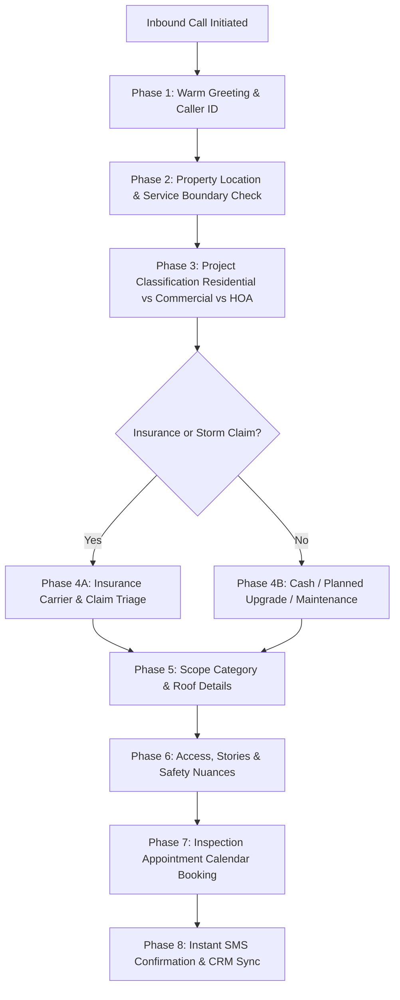

# RHIVE INBOUND CALL FLOW & "NEW PROJECT INPUT FORM" BLUEPRINT
**Unified Telephony Intake & Project Qualification Architecture**

---

## 1. Executive Summary & Flow Philosophy

The **RHIVE New Project Input Form** represents the core operational intake engine of the company. When an inbound lead calls RHIVE Construction, the AI Voice Agent (`Michael Copy` / `Hunni`) acts as the front-line qualifier. 

Every question in the intake sequence exists for a precise operational and financial reason. The flow moves from **Low Friction $\rightarrow$ Entity Classification $\rightarrow$ Technical Scope $\rightarrow$ High-Value Commitment (Inspection Booking)**.

---

## 2. The 7-Step Question Flow & The "Why" Behind Each Step

### Step 1: Warm Greeting & Caller Identification
* **Data Captured:** `{CallerName}`, `{CallerNumber}`
* **The "Why":** Immediate rapport building. Getting the caller's name within the first 10 seconds personalizes the conversation and anchors the CRM contact record before discussing problems.
* **Scripted Voicebot Delivery:**
  > *"Hello! Thank you for calling RHIVE Construction, your trusted partner for roofing and exterior solutions. My name is Hunni. Who do I have the pleasure of speaking with today?"*
* **Caller Response Handling:**
  - *Caller gives name:* *"Fantastic to meet you, {CallerName}! How can our team help you with your property today?"*
  - *Caller immediately states emergency/leak:* *"I completely understand, and we will take care of that right away. May I grab your name real quick so I can pull up your file?"*

---

### Step 2: Property Location & Service Area Verification
* **Data Captured:** `PropertyAddress`, `City`, `ZipCode`
* **The "Why":** Roofing and construction require physical geographic dispatch. Verifying the address immediately confirms if the property is within RHIVE's core service area (Salt Lake County, Utah County, Davis, Weber, Cache, etc.) and allows automated satellite measurement retrieval.
* **Scripted Voicebot Delivery:**
  > *"Got it. To make sure we have our local team mapped out, what is the address of the home or building you're calling about?"*
* **Caller Response Handling:**
  - *Caller gives full address:* *"Perfect, got {PropertyAddress}. Is that in {City}?"*
  - *Caller gives street only:* *"Thank you! And which city and zip code is that located in?"*

---

### Step 3: Project Type & Organization Triage
* **Data Captured:** `ProjectCategory` (`Residential` | `Commercial` | `Government` | `HOA`), `ParentCompany`, `PropertyName`, `CallerRole`
* **The "Why":** A residential homeowner has completely different purchasing criteria (budget, aesthetics, warranty) than a Commercial Facility Manager or HOA Board Member (bidding compliance, PO numbers, tenant coordination).
* **Scripted Voicebot Delivery:**
  > *"Wonderful. And is this for your personal home, a commercial building, or a multi-family property?"*
* **Caller Response Handling:**
  - *If Residential:* *"Great, are you the primary homeowner on title?"*
  - *If Commercial / HOA:* *"Understood. What is the name of the facility or management company, and what is your role there?"*

---

### Step 4: Insurance Claim vs. Retail / Cash Project Triage
* **Data Captured:** `IsInsuranceClaim` (`Yes` | `No`), `InsuranceCarrier`, `ClaimNumber`, `DateOfLoss`, `AdjusterAssigned`
* **The "Why":** Insurance restoration requires supplementing, Xactimate scoping, adjuster coordination, and storm date verification. Retail projects focus on financing, shingle upgrades, and timeline execution.
* **Scripted Voicebot Delivery:**
  > *"Thanks for sharing that. Is this project related to recent storm damage or an insurance claim, or are you looking for a planned retail estimate?"*
* **Caller Response Handling:**
  - *If Insurance:* *"Got it. Have you already filed the claim with your carrier, or do you need our inspector to assess the damage first before filing?"*
  - *If Retail / Out-of-Pocket:* *"Perfect. We offer direct transparent pricing and flexible financing options for full replacements and repairs."*

---

### Step 5: Scope Category & Technical Roof Profiling
* **Data Captured:** `ScopeCategory` (`Full Replacement` | `Repair/Leak Service` | `Storm Restoration` | `Gutters` | `Heat Trace`), `RoofType` (`Asphalt Shingle` | `Metal` | `Flat/TPO` | `Tile`), `CurrentIssue`
* **The "Why":** Pre-qualifies equipment, crew specialization (e.g. flat roofing TPO heat-welding vs steep architectural shingles), and emergency leak mitigation dispatch.
* **Scripted Voicebot Delivery:**
  > *"Can you tell me a little bit about what you're noticing on the roof? Are you dealing with an active leak, missing shingles, or just planning a full upgrade?"*
* **Caller Response Handling:**
  - *Active Leak / Emergency:* *"I hear you. If water is actively dripping, our priority is getting someone out to tarp or dry-in the area quickly."*
  - *Caller doesn't know roof type:* *"No worries at all! Most residential homes in the area have asphalt architectural shingles. Our specialist will verify all materials on-site."*

---

### Step 6: Property Access, Stories & Safety Nuances
* **Data Captured:** `BuildingStories` (`1-Story` | `2-Story` | `3+ Stories`), `AccessNotes` (Gated, Steep Pitch, Dogs, Power Lines)
* **The "Why":** Safety OSHA compliance and ladder sizing. A 3-story steep slope requires a 40-foot ladder or drone inspection, whereas a 1-story rambler can be inspected rapidly.
* **Scripted Voicebot Delivery:**
  > *"Just two quick details for our field crew: Is the home a single-story or two-story, and is there any gate code or pets in the yard we should know about?"*
* **Caller Response Handling:**
  - *Caller responds:* *"Noted! We'll make sure the inspector has the right ladder equipment and safety gear."*

---

### Step 7: The Close — Inspection Calendar Booking
* **Data Captured:** `{AppointmentDate}`, `{AppointmentTime}`, `DecisionMakerConfirmed`
* **The "Why":** The sole objective of the inbound call is securing a firm appointment with all decision-makers present. Without an appointment, lead decay occurs rapidly.
* **Scripted Voicebot Delivery:**
  > *"Awesome. Let's get one of our certified project managers out to do a comprehensive inspection and write up an exact quote for you. We have availability tomorrow morning between 9 AM and 11 AM, or Thursday afternoon around 2 PM. Which of those works better for you?"*
* **Caller Response Handling:**
  - *Caller picks time:* *"You're all set for {AppointmentDate} at {AppointmentTime}. Will all key decision-makers be present so we can review the inspection findings together?"*
  - *Objection ("Can you just give me a rough price over the phone?"):* *"I'd love to give you a number, but because every roof has unique decking, ventilation, and flashing requirements, giving a blind guess wouldn't be fair or transparent to you. Our on-site inspection is 100% free with zero obligation. Let's have our expert take a look so you get an exact, guaranteed price."*

---

### Step 8: Call Wrap-Up & Instant Text Follow-Up
* **Data Captured:** `{AfterCallSummary}`, `WebhookTriggered`
* **The "Why":** Confirms appointment via SMS immediately to reduce no-show rates by 40%.
* **Scripted Voicebot Delivery:**
  > *"Thank you so much, {CallerName}! I've locked you in for {AppointmentDate} at {AppointmentTime}. I'm sending a text confirmation to this number right now with your appointment details and our inspector's contact info. Have a wonderful day, and welcome to RHIVE!"*

---

## 3. Dynamic Variable Mapping Matrix

| Variable Name | JustCall Type | Fallback Value | Form Source Field | Telephony Utility |
| :--- | :--- | :--- | :--- | :--- |
| `CallerName` | `string` | `Customer` | Contact Full Name | Real-time personalization |
| `CallerNumber` | `string` | `-` | Caller ID / Phone | SMS dispatch & CRM search |
| `PropertyAddress`| `string` | `-` | Address Line 1 | Satellite / Roofr lookup |
| `City` | `string` | `Salt Lake City`| Property City | Territory routing |
| `ProjectCategory`| `string` | `Residential` | Residential/Commercial/HOA| Pipeline categorization |
| `ReasonForCalling`| `string` | `Roof Inspection`| Project Intent | Summary logging |
| `AppointmentDate`| `string` | `TBD` | Booking Date | Calendar booking webhook |
| `AppointmentTime`| `string` | `TBD` | Booking Time | Calendar booking webhook |
| `AfterCallSummary`| `string`| `-` | AI Call Brief | Post-call CRM sync |
