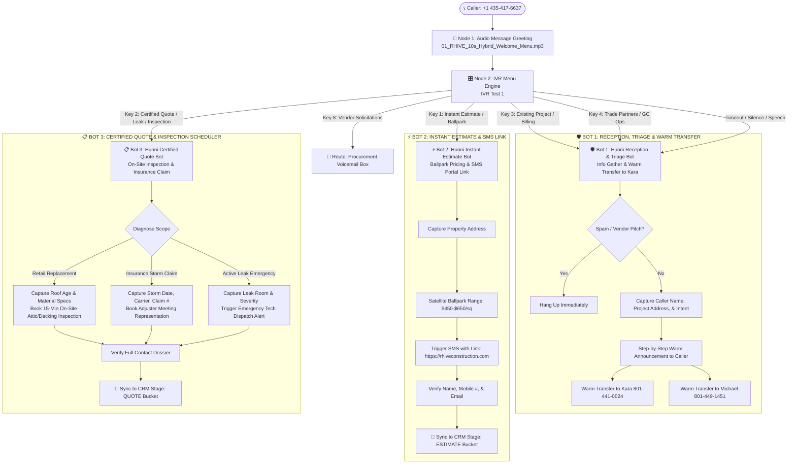

# RHIVE Telephony Suite & 3-Bot Specialist Swarm Architecture

**Target Number:** `+1 (435) 417-6637` (Main Line)  
**Hunni Direct:** `+1 (743) 887-6637`  
**Framework:** 3-Node Specialized Voice Agent Swarm  
**Voice Engine:** `gemini-3.1-flash-tts-preview` (Voice: `Kore`)  
**Core Telephony Rule:** **Estimates are Ballpark; Quotes are Certified.** Zero Cold Transfers.

---

## 🏗️ The 3 Specialized Voice Bots

---

## 📊 Core Business Rule: Estimate vs. Quote Lockdown

| Parameter | ⚡ ESTIMATE (Bot 2) | 📋 QUOTE (Bot 3) |
|---|---|---|
| **Definition** | **Ballpark Preliminary Range** | **Certified Guaranteed Contract Price** |
| **Method** | Satellite AI Imagery / Online Tool | 15-Min On-Site Decking, Attic & Surface Inspection |
| **Pricing Delivery** | Instant SMS Link to `rhiveconstruction.com` | Certified Digital Proposal (24–48h) or On-Site Handshake |
| **Pipeline Board Bucket** | **`Estimate`** Bucket | **`Quote`** Bucket |
| **Required Data** | Street Address + Mobile # | Roof Age, Specs, Storm Date/Carrier, or Leak Severity |

---

## 🛠️ JustCall Workflow Setup & Node Mapping

### Node 1: Audio Message (Greeting)
* **Custom Message Upload:** [`01_RHIVE_10s_Hybrid_Welcome_Menu.mp3`](file:///c:/Users/mjrob/OneDrive/Desktop/App%20Repo%20s/MJR_EPA/scratch/hybrid_ivr_audio/01_RHIVE_10s_Hybrid_Welcome_Menu.mp3)

### Node 2: IVR Menu Engine (`IVR Test 1`)
* **Key 1 (Instant Estimates & Ballparks):** $\rightarrow$ AI Voice Agent: **`Hunni - Instant Estimate Bot`**
* **Key 2 (Certified Quotes, Leaks & Storm Claims):** $\rightarrow$ AI Voice Agent: **`Hunni - Certified Quote Bot`**
* **Key 3 (Existing Projects, Billing, Permits):** $\rightarrow$ AI Voice Agent: **`Hunni - Reception & Triage Bot`** *(Warm Transfer to Kara)*
* **Key 4 (Trade Partners & General Contractor Ops):** $\rightarrow$ AI Voice Agent: **`Hunni - Reception & Triage Bot`** *(Warm Transfer to Michael)*
* **Key 8 (Vendor Solicitations):** $\rightarrow$ **Voicemail Box** *(Procurement)*
* **Timeout / Spoken Silence:** $\rightarrow$ AI Voice Agent: **`Hunni - Reception & Triage Bot`**
