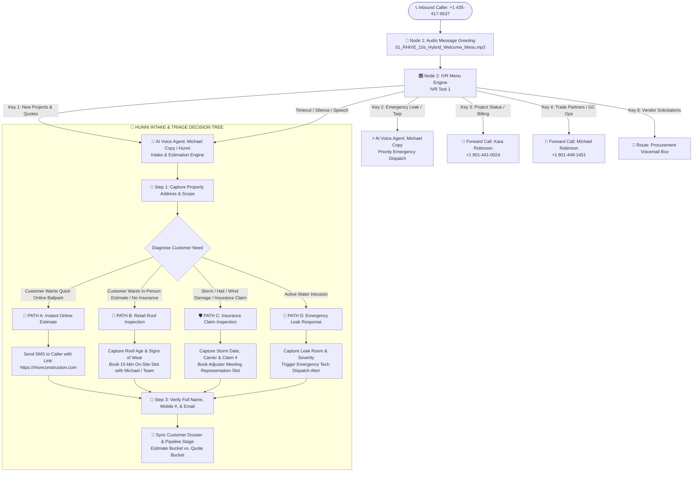

# RHIVE Telephony Topology & Autonomous Intake Workflow Map

---

## 🛠️ JustCall Workflow Canvas Connection Matrix

| Workflow Node | Target Destination | Voice / Audio Config | Failover / Unanswered |
|---|---|---|---|
| **Start / Inbound** | Node 1: `Audio Message` | Number: `+1 (435) 417-6637` | — |
| **Node 1 (`Audio Message`)** | Node 2: `IVR Test 1` | `01_RHIVE_10s_Hybrid_Welcome_Menu.mp3` | Next Step |
| **`IVR Test 1` (Key 1)** | `AI Voice Agent` | Agent: **`Michael Copy`** | Voicemail / Michael |
| **`IVR Test 1` (Key 2)** | `AI Voice Agent` | Agent: **`Michael Copy`** (Emergency Priority) | Michael `(801) 449-1451` |
| **`IVR Test 1` (Key 3)** | `Forward Call` | Number: **`+1 (801) 441-0024`** *(Kara)* | Kara Voicemail |
| **`IVR Test 1` (Key 4)** | `Forward Call` | Number: **`+1 (801) 449-1451`** *(Michael)* | Michael Voicemail |
| **`IVR Test 1` (Key 8)** | `Voicemail` | Procurement Greeting | Voicemail Box |
| **`IVR Test 1` (Timeout)** | `AI Voice Agent` | Agent: **`Michael Copy`** | Voicemail / Michael |
